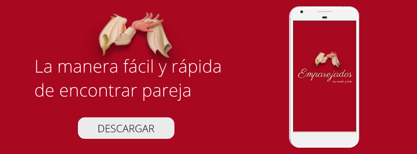

# Emparejados
Emparejados es una aplicación móvil que ayuda a bailarines de Marinera Norteña a encontrar pareja de baile para sus próximos concursos.

## ¿Cómo nace Emparejados?

Cada año el coliseo Gran Chimú (Trujillo) reúne a más de 50 mil personas del mundo de la marinera para realizar el concursos mundial de la Marinera.
