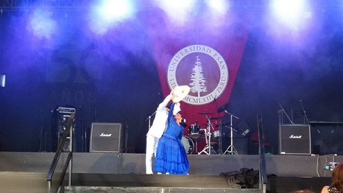

# Emparejados

Emparejados es una aplicación móvil que ayuda a bailarines de Marinera Norteña a encontrar pareja de baile para sus próximos concursos.

## ¿Cómo nace Emparejados?

Cada año el coliseo Gran Chimú (Trujillo) reúne a más de 50 mil personas para realizar el concurso más grande de la Marinera en la cual participan más de mil parejas de todas las edades y de todas partes del Perú y el mundo.[(El Comercio)](https://elcomercio.pe/peru/la-libertad/trujillo-1-200-parejas-participaran-concurso-marinera-noticia-486606).

Para el presente año (2018) se han abierto más de 100 concursos tanto noveles como nacionales y en los cuales decenas de niños, jóves y adulto mayor esperan participar con ansias. He aquí el motivo por el cual EMPAREJADOS nace como idea para mi proyecto.[Ver celendario de concursos](http://www.todaslassangres.com/calendarioconcursos.html)

### Mi experiencia en este mundo Marinerístico

Antes de comenzar con mi investigación debo comentar que bailo Marinera desde los 7 años de edad (actualmente tengo 22 años). He concursado muchas veces, pero nunca me ha sido fácil encontrar una pareja para ir a los distintos concursos.

> Presentación 2015, Talent Show de la univesidad Esan.

## Comencemos...

### Buscando a mi pareja ideal ♥ (Benchmarking)

**Redes sociales** : Indagando por las redes sociales encontré muchos grupos de Facebook que ofrecen un espacio abierto para que los interesados en consursar próximamente posteen un anuncio buscando a su "pareja ideal".
- [Grupo de Facebook 1](https://www.facebook.com/groups/140547206033759/about/)
- [Grupo de Facebook 2](https://www.facebook.com/profile.php?id=100011645163495)

**Googleando** : Así como en las redes sociales también encontré una página web en la cual bailarines de Tango buscan una pareja de baile.[ver página](http://www.losbailesdesalon.com/foros/buscar.html)

La forma de encontrar una pareja de baile por estos dos medio es muy parecida, el flujo es el siguiente
[ver aquí](https://realtimeboard.com/app/board/o9J_kzspRrI=/)

**Tinder** : Otra de las fuentes en mi investigación fue Tinder, ya que el objetivo de Emparejados es unir a dos personas para bailar Marinera, Tinder me ayudó a idear la manera del cómo dos personas sin conocerse pueden llegar a pactar un cita o simplemente conocer genten con tus mismos intereses.

### Preguntemos a los expertos (Encuestas)

Luego de haber analizado las diferentes manera de encontrar una pareja de baile, era necesario conocer a mis usuarios objetivos y preguntarles su opinión acerca de una aplicación que les podría ayudar a encontrar sus parejas de baile de una forma más rápida y eficiente.

Ver encuestas [aquí](https://goo.gl/forms/SgFPUgihpdCjkBDn2)

### Agrupando ideas y respuestas (Affinity map)

ver [aquí](https://realtimeboard.com/app/board/o9J_kztQAII=/)

### Descubriendo a nuestro usuario objetivo (User persona)

### Qué necesitan mis usuarios (Problems statements)

- Usuarios necesitan ver recomentaciones o ver cómo baila la pareja con la que quieren ir algun concurso.
- Usuarios necesita información actualizada las personas que buscan una pareja de baile (datos exactos como edad, disponibilidad, contantos,etc.)
- Usuarios quisieran encontrar información de parejas de baile en un solo lugar
- Usuarios quisieran dar recomendaciones de cómo fue su experiencia bailando con la persona con la que fueron algun concurso

### The most important "How Might We"

- Cómo hacer que dos personas sin conocerse bailen en un concurso de Marinera.

### What if

- What if con solo ver videos elijo con quién quiero bailar.

### Ideando la primera versión de EMPAREJADOS (Prototipando)

- Como primeva versión, la aplicación se enfocóno en 3 funcionalidades básica
 * Mostrar videos de bailarines en sus ensayos o simplemente bailando Marinera.
 * Los usuarios interesado en algún video puedan hacer match.
 * Chat para que los usuarios puedan intercambiar información.

### Probando el prototipo en la cancha (Testing)

Para la relalización de este primer testeo se les envió el [link](https://marvelapp.com/2ej3a33/screen/39843183) a diferentes usuarios que buscan una pareja de Marinera y se les pidió que envíen sus comentarios sobre qué les pareció la aplicación mediante un audio mensaje a un número de Whatsapp que se les brindó. A continuación los audios enviados por los usuarios.
 - [Escuchar audios](https://drive.google.com/drive/folders/10Dryu98KWU5PL1wiq0VOMp2geptadUh2?usp=sharing)

Usuario 1 : Ivan Lazo, profesor de Marinera.

   * El usuario 1 comenta que le gustó mucho la aplicación y que sería muy útil para las personas que buscan  pareja. En su experiencia, ya que él es quien busca parejas a sus diferentes alumnos, comenta que es algo complicado encontrar pareja a las chicas y que esta aplicación le ayudaría mucho. Algo que el usuario 1 le agregaría a la aplicación sería una sección de comentarios para que las personas puedan dar opiniones sobre su experiencia bailando con la pareja que eligieron.

Usuario 2 : Andrea E., bailarina de diferentes danzas peruanas.

   * La usuario comenta que le gustaría ver más perfiles (más videos de personas bailando), por lo demás comenta que le gusta la aplicación.

### Versión final del prototipo

Para este versión se agregó una sección de comentarios, en la cual los usuarios podrán dar una recomentación de la persona con la que bailaron anteriormente.

 

